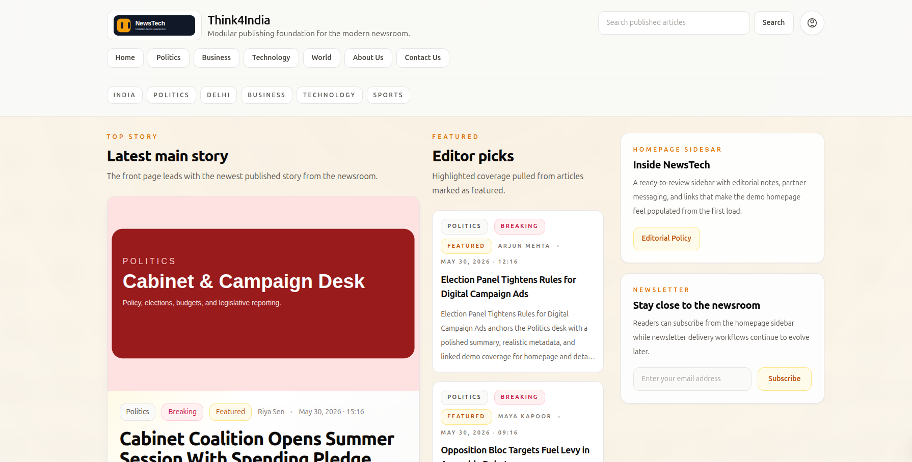
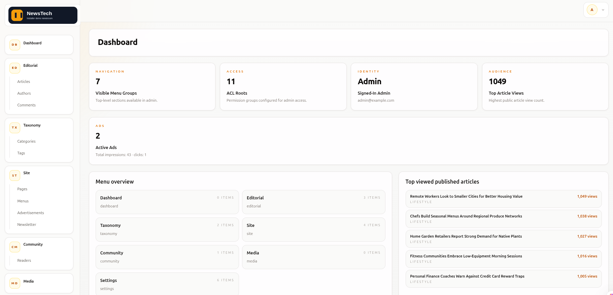

# NewsTech

A modular Laravel-based news CMS with admin publishing tools, frontend news pages, media management, reader accounts, comments, newsletters, advertisements, SEO tools, and guided installer.

## Screenshots





## Feature Overview

- Admin dashboard
- Categories, tags, and authors
- Articles and news publishing
- Static pages
- Frontend homepage, article, category, tag, author, and search pages
- Media library and reusable media picker
- Rich text editor with inline images
- Multi-category articles
- Comments, moderation, anti-spam, and threaded replies
- Reader registration, login, password reset, and email verification
- Bookmarks, folders, and reading history
- Advertisement manager
- Newsletter subscribers and campaigns
- SEO Toolkit with real-time score feedback
- Menus and settings
- Sitemap, RSS, and robots output
- Guided installer with optional demo content

## Architecture Overview

- Package-driven architecture
- `packages/NewsTech/Admin` owns admin UI and admin routes
- `packages/NewsTech/Frontend` owns public UI and frontend routes
- Feature packages own models, migrations, repositories, providers, config, and domain logic
- Render events and the settings registry provide clean extension points

## Requirements

- PHP 8.2+
- Composer 2+
- MySQL 8+ or a compatible MariaDB version
- Node.js and npm only for development or asset builds
- Required PHP extensions:
  - `bcmath`
  - `ctype`
  - `fileinfo`
  - `gd` or `imagick`
  - `json`
  - `mbstring`
  - `openssl`
  - `pdo_mysql`
  - `tokenizer`
  - `xml`
- `pdo_sqlite` / `sqlite3` for the default PHPUnit test setup

## Installation

```bash
composer create-project 

php artisan newstech:install
```

`php artisan newstech:install` is the guided installer. It:

- asks for database details if needed
- runs migrations
- creates the storage link
- creates the default admin user
- optionally installs demo content

## Default Admin Credentials

```txt
Email: admin@newstech.test
Password: password
```

Change the default password immediately before any production use.

## Environment Configuration

`.env` is not committed. Use `.env.example` as the starting point and never commit real secrets, `APP_KEY`, database passwords, or production credentials.

```

## Development Commands

```bash
composer install
php artisan newstech:install
php artisan serve
```

Asset commands are only needed for local development or rebuilding frontend/admin assets:

```bash
npm install
npm run build
npm run dev
```

## Testing

```bash
php artisan test --compact
```

The default PHPUnit setup expects `pdo_sqlite` / `sqlite3` support unless you configure a different test database.

## Demo Content

The installer can install demo content for local review. Demo content includes categories, tags, authors, pages, menus, articles, images, comments, reader and bookmark data, newsletter data, and sample advertisement data. Demo images are local package-owned assets.

## Core vs Add-ons

NewsTech Core includes the base CMS functionality in this repository. Additional future capabilities can be shipped as optional add-on packages without changing the core publishing workflow.

## Package Development Rules

- Admin routes and views stay in the Admin package
- Frontend routes and views stay in the Frontend package
- Feature packages own models, migrations, repositories, providers, config, and business logic
- Use render events and the settings registry for extensions

## Roadmap

- Analytics dashboard
- Advanced SEO reporting
- Newsletter templates and queue scheduling
- Advertisement rotation and reporting
- Notifications
- Personalization

## License

Licensed under the [MIT License](LICENSE).
